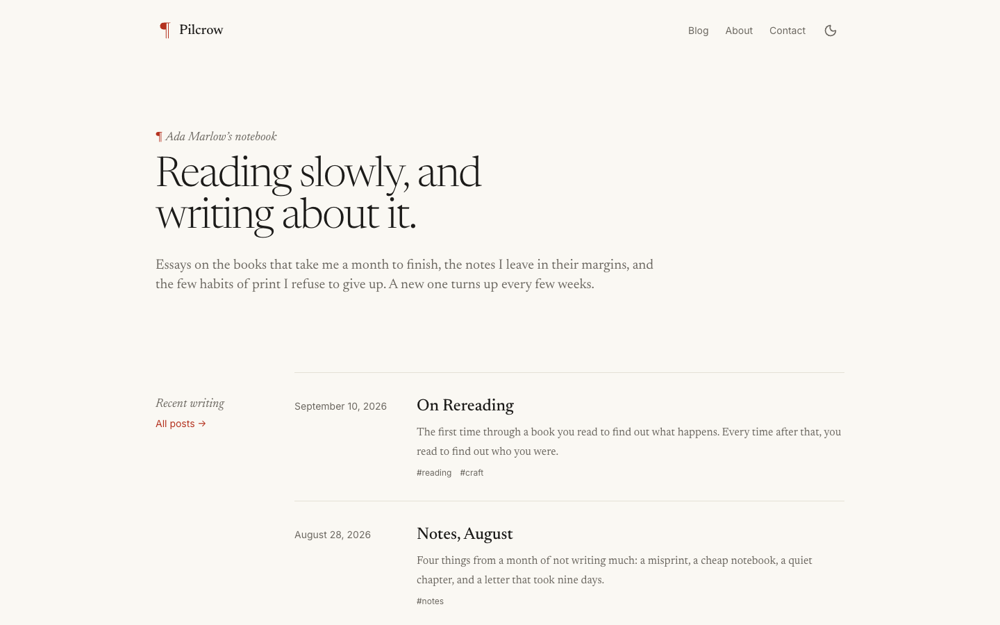

# Pilcrow

A quiet, typography-first Astro theme for writers. Good type, generous measure, nothing else in the way.

[Live demo](https://pilcrow-free.ondelva.com) · [Pro demo](https://pilcrow.ondelva.com) · [Get Pro](https://buy.polar.sh/polar_cl_8dCt7ufpdKweXNgPSp3DH73SlxkMoirMTbBuF3WJooD)



## Features

- Astro 7 + Tailwind CSS v4, zero client-side JS by default
- Blog with tags, pagination, RSS, sitemap, JSON-LD
- Dark mode, responsive from 360px, Lighthouse 95+
- Type-safe content collections (MDX)
- `AGENTS.md` included — works out of the box with Claude Code / Cursor

## Quick start

```sh
pnpm create astro@latest my-site -- --template ondelva/astro-theme-pilcrow
cd my-site
pnpm install
pnpm dev
```

## Configure

Edit `src/config.ts`. Everything site-specific lives there: name, URL, navigation, social links, SEO defaults.
Colors and fonts: `src/styles/global.css` (`@theme` block). See [docs/customization.md](docs/customization.md).

## Deploy

Static output. Works on Cloudflare Pages, Vercel, Netlify.
[](https://deploy.workers.cloudflare.com/?url=https://github.com/ondelva/astro-theme-pilcrow)

See [docs/deploy.md](docs/deploy.md).

## Free vs Pro

This is the free, MIT-licensed edition. Pilcrow Pro is built on the same code and adds the following ([Pro demo](https://pilcrow.ondelva.com)):

|                | Free                                            | Pro                                                                                           |
| -------------- | ----------------------------------------------- | --------------------------------------------------------------------------------------------- |
| Pages          | Home, About, Blog, Contact, Privacy, Terms, 404 | + Pricing, Features, Team, Newsletter, Changelog, Docs, Work, Cookies, Accessibility          |
| Home sections  | 5                                               | 20                                                                                            |
| Blog           | Tags, pagination, RSS                           | + Authors, series, table of contents, reading time, related posts, callouts, copy-code button |
| SEO            | Meta, Open Graph, sitemap, JSON-LD              | + Generated Open Graph image per post                                                         |
| Search         | –                                               | Pagefind                                                                                      |
| i18n           | UI strings (en, ko)                             | + Localized routes, language switcher, hreflang                                               |
| Integrations   | Analytics, Web3Forms contact form               | + Buttondown / Kit newsletter, Giscus comments, in-page form submit                           |
| Theme variants | 1 color preset                                  | 4 color presets, 3 font pairings                                                              |
| Support        | GitHub Issues                                   | Email (im@ondelva.com), 2 business days                                                       |

[See the Pro demo →](https://pilcrow.ondelva.com) · [Get Pro →](https://buy.polar.sh/polar_cl_8dCt7ufpdKweXNgPSp3DH73SlxkMoirMTbBuF3WJooD)

## License

[MIT](LICENSE).
Third-party assets: [THIRD-PARTY-NOTICES.md](THIRD-PARTY-NOTICES.md)
